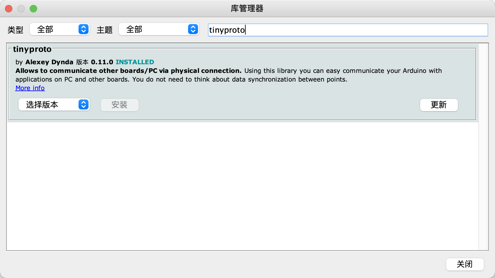

# QCar_first_node

本仓库为铁道出版社《自动驾驶决策规划技术理论与实践》第11.1小节，让车动起来的附录代码。分为两部分：

## 1. Quanser QCar上下位机通信示例

> 需要在Quanser QCar上的Jetson TX2上运行

使用方式：

```
rosrun qcar_example qcarnode.py
```

## 2. ROS+Arduino上下位机通信示例

下位机在Arduino的库管理器中搜索tinyproto并安装：



`arduino_example/arduino_code/main.ino`为下位机代码，需修改其中的PWM引脚达到输出控制量的目的。


上位机安装 [Tinyproto](https://github.com/lexus2k/tinyproto)：

```
git clone --branch stable https://github.com/lexus2k/tinyproto.git
cd tinyproto
mkdir build && cd build
cmake ..
make -j
sudo make install
```

编译后执行：

```
rosrun arduino_example arduino_example_node
```